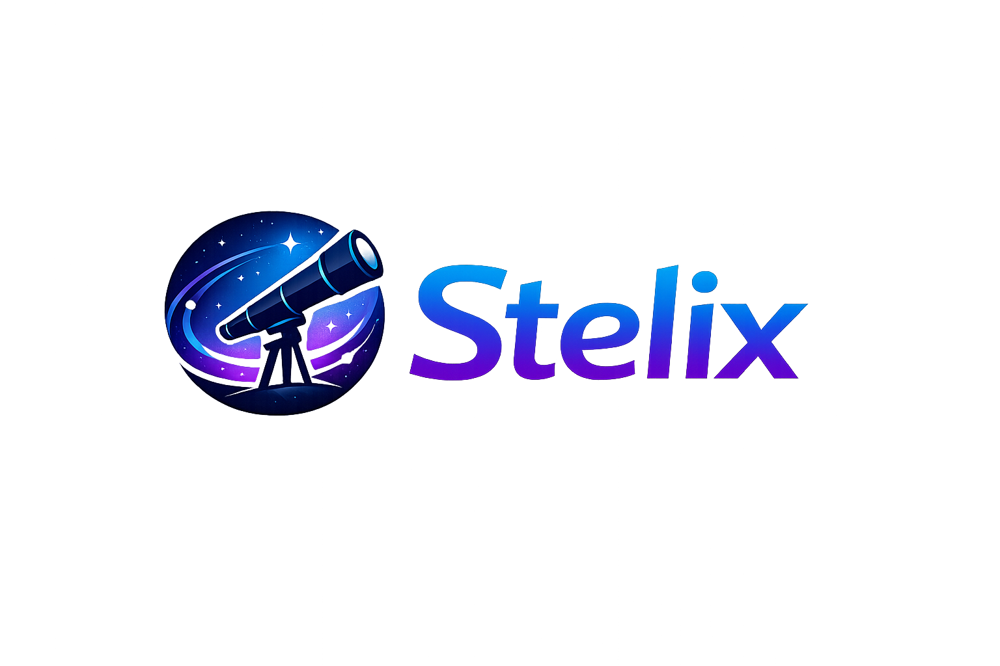

# Stelix
### Where Data Becomes Discovery

Stelix is a software initiative focused on building tools that simplify and accelerate astrophysics research. The goal of Stelix is to make astrophysical data reduction, analaysis, and workflows faster, cleaner, and widely accessible.

## Installation
Coming Soon

## Usage
Coming Soon

## Projects
Coming Soon

## Contributions
Stelix welcomes the contributions of all researchers, students, and developers interested in improving our tools and software.

## Liscense
Stelix is licensed under the MIT License.
